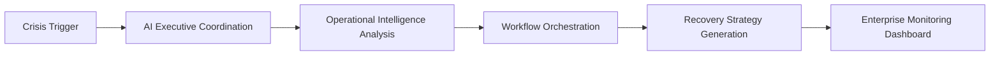

This is a [Next.js](https://nextjs.org) project bootstrapped with [`create-next-app`](https://nextjs.org/docs/app/api-reference/cli/create-next-app).

## Getting Started# GHOST BOARD — Autonomous AI Executive Coordination System

> Real-time enterprise crisis orchestration powered by autonomous AI executives.


---

# 🌐 Live Demo

### 🔗 https://ghostboard-sable.vercel.app/

Explore the autonomous enterprise command center live.

---

# 🚀 What is GHOST BOARD?

GHOST BOARD is a cinematic multi-agent enterprise AI operating system designed to simulate autonomous executive coordination during operational crises.

Unlike traditional AI assistants that operate independently, GHOST BOARD orchestrates multiple specialized AI executives that collaboratively analyze incidents, escalate risks, coordinate workflows, and generate recovery strategies in real time.

The platform simulates enterprise-scale operational scenarios including:

- Cyberattacks
- Infrastructure outages
- Payment processing failures
- Security incidents
- Operational disruptions

AI executives communicate through live operational intelligence systems, generate department-specific analysis, coordinate recovery actions, and simulate enterprise-wide decision-making environments.

---

# 🧠 AI Executive System

GHOST BOARD includes specialized autonomous AI executives:

- 🧑‍💼 CEO AI — Strategic enterprise coordination
- 🛠 CTO AI — Infrastructure and technical operations
- 🛡 Security AI — Threat analysis and security escalation
- ⚙️ Operations AI — Recovery workflow coordination
- 👥 HR AI — Workforce communication systems
- 📢 Marketing AI — Customer sentiment and reputation monitoring

Each executive collaborates autonomously through workflow orchestration pipelines and operational intelligence systems.

---

# ✨ Core Features

- Multi-agent AI executive orchestration
- Real-time crisis simulation engine
- Enterprise operational intelligence dashboards
- Autonomous recovery coordination
- Live executive communication feeds
- AI-generated executive reporting
- Predictive operational analytics
- Security operations visualization
- Infrastructure monitoring systems
- n8n workflow automation pipelines
- Real-time webhook orchestration
- Cinematic enterprise command-center interface

---


# 🔄 How It Works



---

# 🧩 Multi-Agent Architecture

GHOST BOARD uses a collaborative AI coordination model where autonomous executives communicate through real-time orchestration pipelines.

The system transforms AI reasoning into structured operational intelligence through:

- Executive coordination systems
- Workflow automation pipelines
- Operational telemetry feeds
- Recovery orchestration workflows
- Enterprise analytics dashboards
- Security escalation systems

---

# ⚡ Technology Stack

## Frontend

- Next.js 15
- TypeScript
- TailwindCSS
- Framer Motion

## AI + Automation

- OpenRouter AI Models
- n8n Workflow Automation
- Multi-Agent Orchestration Pipelines

## Infrastructure

- Railway
- Vercel
- Real-time Webhook Systems

---

# 🎥 Demo Presentation

The project presentation demonstrates:

- Real-time enterprise crisis simulations
- Autonomous AI executive coordination
- Workflow orchestration systems
- Operational intelligence dashboards
- Security escalation pipelines
- Recovery management systems

---

# 🌌 Vision

GHOST BOARD explores a future where enterprises are operated through collaborative AI executive systems capable of analyzing incidents, coordinating workflows, escalating risks, and managing operational recovery autonomously in real time.

The platform reimagines enterprise operations by transforming isolated AI assistants into synchronized executive intelligence systems.

---

# 🏆 Hackathon Submission

Built for:

## AI Agent Olympics 2026

GHOST BOARD represents a cinematic vision of future enterprise operations powered by autonomous collaborative AI systems.

---

# 📡 Deployment

## Live Website

https://ghostboard-sable.vercel.app/

---

# 👨‍💻 Developer

### Neural Forge

Built by:
**Bacchu Sai Vidwan**

---

# ⚠️ Disclaimer

GHOST BOARD is a simulated enterprise AI coordination environment created for demonstration, experimentation, and hackathon innovation purposes.

---

# 🌐 The Future Enterprise Will Not Just Use AI

# It Will Be Operated By AI.

First, run the development server:

```bash
npm run dev
# or
yarn dev
# or
pnpm dev
# or
bun dev
```

Open [https://ghostboard-sable.vercel.app/](https://ghostboard-sable.vercel.app/) with your browser to see the result.

You can start editing the page by modifying `app/page.tsx`. The page auto-updates as you edit the file.

This project uses [`next/font`](https://nextjs.org/docs/app/building-your-application/optimizing/fonts) to automatically optimize and load [Geist](https://vercel.com/font), a new font family for Vercel.

## Learn More

To learn more about Next.js, take a look at the following resources:

- [Next.js Documentation](https://nextjs.org/docs) - learn about Next.js features and API.
- [Learn Next.js](https://nextjs.org/learn) - an interactive Next.js tutorial.

You can check out [the Next.js GitHub repository](https://github.com/vercel/next.js) - your feedback and contributions are welcome!

## Deploy on Vercel

The easiest way to deploy your Next.js app is to use the [Vercel Platform](https://vercel.com/new?utm_medium=default-template&filter=next.js&utm_source=create-next-app&utm_campaign=create-next-app-readme) from the creators of Next.js.

Check out our [Next.js deployment documentation](https://nextjs.org/docs/app/building-your-application/deploying) for more details.
